# PerceptEye Native - Imitation Learning System Documentation

## 🎯 System Overview

**PerceptEye Native** is an AI-powered **imitation learning system** that learns workflows from user demonstrations and executes them autonomously.

### Core Philosophy
- **Learn by Watching**: Record user demonstrations once
- **Understand Deeply**: Multi-modal AI analysis of every interaction  
- **Execute Intelligently**: Autonomous agents that adapt to changes
- **Improve Continuously**: Learning from successes and failures

### System Flow Diagram

```mermaid
graph TD
    A["👤 User Records<br/>Workflow"] --> B["📹 Screen Capture<br/>& Metadata"]
    B --> C["🤖 Multi-Model<br/>AI Analysis"]
    C --> D["🕸️ Workflow Graph<br/>Generation"]
    D --> E["🧠 Knowledge Base<br/>Storage"]
    E --> F["🎯 Agent Execution<br/>Engine"]
    F --> G["✅ Autonomous<br/>Workflow Execution"]
    
    C --> H["👁️ Computer Vision<br/>UI Detection"]
    C --> I["📝 OCR Text<br/>Extraction"]
    C --> J["🎬 Action<br/>Classification"]
    
    H --> D
    I --> D
    J --> D
    
    style A fill:#e1f5fe
    style G fill:#e8f5e8
    style C fill:#fff3e0
    style D fill:#f3e5f5
```

---

## 🏗️ Architecture Layers

The system is built in four distinct layers, each handling specific responsibilities:

```mermaid
graph LR
    subgraph "📱 Frontend Layer"
        A1["🖥️ Electron App"]
        A2["⚛️ React UI"]
        A3["📹 Screen Recorder"]
    end
    
    subgraph "🔄 Processing Layer"
        B1["🎥 Video Analysis"]
        B2["🤖 AI Models"]
        B3["🕸️ Graph Engine"]
    end
    
    subgraph "💾 Data Layer"
        C1["📂 Local Storage"]
        C2["🗃️ PostgreSQL"]
        C3["🔍 Vector DB"]
    end
    
    subgraph "🎯 Execution Layer"
        D1["🤖 Agent Engine"]
        D2["🌐 BrowserUse"]
        D3["⚡ Automation"]
    end
    
    A1 --> B1
    A2 --> B2
    A3 --> C1
    
    B1 --> C2
    B2 --> C3
    B3 --> D1
    
    C2 --> D2
    C3 --> D3
    D1 --> D2
    
    style A1 fill:#e3f2fd
    style B2 fill:#fff8e1
    style C3 fill:#f1f8e9
    style D1 fill:#fce4ec
```

### 📱 **Frontend Layer**
- **Electron App**: Cross-platform desktop application with native OS integration
- **React UI**: Modern, responsive interface with Material-UI components
- **Screen Recorder**: High-quality workflow capture with source selection

### 🔄 **Processing Layer** 
- **Video Analysis**: Multi-model AI pipeline for comprehensive understanding
- **AI Models**: Specialized vision and language models working in concert
- **Graph Engine**: Converts analysis results into executable workflow structures

### 💾 **Data Layer**
- **Local Storage**: Immediate video and metadata storage for privacy
- **PostgreSQL**: Structured workflow data with relationships
- **Vector DB**: Semantic search and similarity matching for workflow discovery

### 🎯 **Execution Layer**
- **Agent Engine**: Intelligent workflow execution with adaptation capabilities
- **BrowserUse**: Web automation framework for browser interactions
- **Automation**: Cross-application control and system integration

---

## 🎥 Video Analysis Pipeline

The heart of the system is a sophisticated multi-stage analysis pipeline that transforms raw screen recordings into executable workflow graphs.

```mermaid
flowchart TD
    A["📹 Raw Video Input"] --> B["🎞️ Frame Extraction<br/>(1-5 FPS)"]
    
    B --> C1["👁️ Computer Vision<br/>UI Element Detection"]
    B --> C2["📝 OCR Engine<br/>Text Extraction"]
    B --> C3["🎬 Action Classifier<br/>User Actions"]
    
    C1 --> D1["🔘 Buttons"]
    C1 --> D2["📝 Input Fields"]
    C1 --> D3["📋 Menus"]
    C1 --> D4["🪟 Windows"]
    
    C2 --> E1["📄 Page Text"]
    C2 --> E2["🏷️ Labels"]
    C2 --> E3["💬 Messages"]
    
    C3 --> F1["🖱️ Clicks"]
    C3 --> F2["⌨️ Typing"]
    C3 --> F3["📜 Scrolling"]
    C3 --> F4["🖱️ Drag & Drop"]
    
    D1 --> G["🧠 Context Fusion<br/>& Analysis"]
    D2 --> G
    D3 --> G
    D4 --> G
    E1 --> G
    E2 --> G
    E3 --> G
    F1 --> G
    F2 --> G
    F3 --> G
    F4 --> G
    
    G --> H["🕸️ Workflow Graph<br/>Generation"]
    
    style A fill:#ffebee
    style G fill:#e8f5e8
    style H fill:#e1f5fe
```

### Key Processing Stages:

1. **🎞️ Frame Extraction**: Smart sampling at 1-5 FPS to capture key moments and transitions
2. **👁️ Computer Vision**: Detection of UI elements (buttons, inputs, menus, windows) using YOLO and custom models
3. **📝 OCR Processing**: Text extraction from all visible content using Tesseract and EasyOCR
4. **🎬 Action Classification**: Recognition of user actions (clicks, typing, scrolling, drag-drop)
5. **🧠 Context Fusion**: Combining all analysis streams into coherent workflow understanding
6. **🕸️ Graph Generation**: Creating executable workflow structures with temporal relationships

### AI Model Stack

**🔍 Vision Models:**
- **Qwen2.5-VL**: Primary visual understanding and scene analysis
- **YOLO v8**: Precise UI element detection and classification
- **Custom CNN**: Specialized action recognition from frame sequences
- **OCR Engines**: Tesseract and EasyOCR for robust text extraction

**🧠 Language Models:**
- **Gemini API**: Primary reasoning, planning, and workflow optimization
- **OpenRouter**: Fallback processing and specialized analysis tasks
- **Qwen2.5 Local**: Privacy-sensitive processing and offline capabilities

**⚡ Specialized Models:**
- **Action Classifiers**: Custom-trained networks for user interaction recognition
- **Sequence Models**: LSTM/Transformer architectures for temporal pattern analysis
- **Similarity Models**: Vector embeddings for workflow comparison and search

---

## 🕸️ Workflow Graph Structure

Workflows are represented as directed graphs with three main types of nodes, each serving specific purposes in workflow execution:

```mermaid
graph TD
    subgraph "🎯 Action Nodes"
        A1["🖱️ Click Action<br/>Target: Button<br/>Coords: (x,y)"]
        A2["⌨️ Type Action<br/>Text: 'Hello'<br/>Target: Input"]
        A3["📜 Scroll Action<br/>Direction: Down<br/>Amount: 300px"]
    end
    
    subgraph "🤔 Decision Nodes"
        B1["❓ Condition<br/>If element exists"]
        B2["🔄 Loop<br/>Repeat 3 times"]
        B3["⚠️ Error Handler<br/>On failure"]
    end
    
    subgraph "🌐 Context Nodes"
        C1["📱 App Switch<br/>To: Chrome"]
        C2["🪟 Window Mgmt<br/>Maximize"]
        C3["⏱️ Wait Node<br/>2 seconds"]
    end
    
    A1 --> B1
    B1 -->|Yes| A2
    B1 -->|No| B3
    A2 --> C3
    C3 --> A3
    
    B2 --> A1
    A3 --> B2
    
    C1 --> A1
    C2 --> C1
    
    style A1 fill:#e3f2fd
    style B1 fill:#fff3e0
    style C1 fill:#e8f5e8
```

### 🎯 **Action Nodes**
- **🖱️ Click Actions**: Precise targeting with coordinates, selectors, and visual references
- **⌨️ Type Actions**: Text input with target field identification and content validation
- **📜 Scroll Actions**: Directional scrolling with distance parameters and boundary detection
- **🖱️ Drag & Drop**: Complex interactions with source and destination targeting

### 🤔 **Decision Nodes**
- **❓ Conditionals**: If-then logic based on UI state, element presence, or content
- **🔄 Loops**: Repetitive action sequences with termination conditions
- **⚠️ Error Handlers**: Graceful failure recovery with alternative execution paths
- **🎯 Validators**: Success criteria checking and workflow completion verification

### 🌐 **Context Nodes**
- **📱 App Switches**: Application focus changes with window management
- **🪟 Window Management**: Resize, move, minimize, maximize operations
- **⏱️ Wait States**: Explicit delays for loading, animations, or user confirmation
- **🔧 System Integration**: File operations, clipboard management, notifications

---

## ⏱️ Process Timeline

### Phase Details:

**🎬 Recording Phase (1-5 minutes)**
- User demonstrates workflow naturally
- System captures high-quality video with metadata
- Optional voice narration for context
- Automatic application and window tracking

**🔍 Analysis Phase (2-10 minutes)**
- Multi-model AI processing pipeline
- Parallel analysis streams for efficiency
- Quality validation and confidence scoring
- Human review integration for complex workflows

**🧠 Learning Phase (1-3 minutes)**
- Graph structure optimization
- Pattern matching with existing workflows
- Knowledge base integration and indexing
- Similarity clustering for workflow families

**⚡ Execution Phase (Real-time)**
- Context-aware workflow loading
- Adaptive execution with error recovery
- Real-time UI change detection and adaptation
- Success monitoring and feedback collection

---

## 🤖 Agent Execution Engine

The execution engine is designed for intelligent, adaptive workflow automation that can handle real-world variability and changes.

```mermaid
graph TD
    subgraph "🎯 Agent Execution Engine"
        A["🧠 Workflow Planner<br/>Load graph & context"]
        B["👁️ Visual Validator<br/>Verify UI elements"]
        C["🎬 Action Executor<br/>Perform actions"]
        D["🔄 Adaptive Handler<br/>Handle changes"]
        E["📊 Success Monitor<br/>Track completion"]
    end
    
    subgraph "🌐 BrowserUse Integration"
        F["🖱️ Mouse Control"]
        G["⌨️ Keyboard Input"]
        H["📄 Page Navigation"]
        I["🔍 Element Finding"]
    end
    
    subgraph "🧠 Intelligence Layer"
        J["🎯 Intent Recognition"]
        K["🔄 Error Recovery"]
        L["📈 Learning Updates"]
        M["🎨 UI Adaptation"]
    end
    
    A --> B
    B --> C
    C --> D
    D --> E
    E --> A
    
    C --> F
    C --> G
    C --> H
    C --> I
    
    B --> J
    D --> K
    E --> L
    B --> M
    
    style A fill:#e1f5fe
    style C fill:#e8f5e8
    style J fill:#fff3e0
```

### Core Components:

**🧠 Workflow Planner**
- Loads workflow graphs with full context understanding
- Analyzes current environment state
- Plans optimal execution sequence with contingencies
- Handles parameter substitution and customization

**👁️ Visual Validator**
- Real-time UI element verification using computer vision
- Confidence scoring for element matches
- Alternative element discovery when primary targets unavailable
- Layout change detection and adaptation

**🎬 Action Executor**
- Precise action execution with timing optimization
- Multi-modal interaction (mouse, keyboard, touch)
- Cross-platform compatibility and native integration
- Action verification and rollback capabilities

**🔄 Adaptive Handler**
- Intelligent error recovery with multiple strategies
- Dynamic workflow modification based on context changes
- Learning from execution failures for future improvement
- Graceful degradation when automation isn't possible

**📊 Success Monitor**
- Real-time workflow progress tracking
- Success criteria validation and completion verification
- Performance metrics collection and analysis
- User feedback integration for continuous improvement

---

## 🗃️ Data Architecture

### Workflow Storage Schema

**Core Workflow Entity:**
- Unique workflow identifier and metadata
- Recording source information and quality metrics
- Success rate tracking and performance analytics
- User annotations and manual corrections

**Graph Structure:**
- Node definitions with action parameters
- Edge relationships with timing and conditions
- Execution paths and alternative routes
- Confidence scores and validation states

**Knowledge Relationships:**
- Similar workflow clustering and families
- Reusable component identification and extraction
- Pattern libraries for common interaction sequences
- User-specific customizations and preferences

### Vector Database Integration

**Semantic Search Capabilities:**
- Natural language workflow queries
- Visual similarity matching for UI elements
- Action sequence pattern recognition
- Context-aware workflow recommendations

**Embedding Strategies:**
- Multi-modal embeddings combining visual and textual features
- Temporal sequence embeddings for action patterns
- Hierarchical embeddings for workflow components
- User behavior embeddings for personalization

---

## 🔧 Integration APIs

### Core Workflow APIs

**Recording Management:**
- Upload and process new workflow recordings
- Retrieve workflow metadata and analysis results
- Update workflow success rates and user feedback
- Delete or archive obsolete workflows

**Execution Control:**
- Start workflow execution with parameters
- Monitor execution progress and status
- Interrupt or modify running workflows
- Retrieve execution logs and performance metrics

**Knowledge Discovery:**
- Search workflows by natural language queries
- Find similar workflows and suggest alternatives
- Explore workflow patterns and common components
- Access workflow analytics and usage statistics

### Agent Integration

**BrowserUse Framework:**
- Seamless integration with web automation capabilities
- Cross-browser compatibility and testing
- Element interaction strategies and fallbacks
- Session management and state persistence

**System Automation:**
- Native application control and integration
- File system operations and management
- Clipboard and inter-application communication
- System notifications and user alerts

---

## 📈 Learning and Improvement

### Continuous Learning Mechanisms

**Success Rate Optimization:**
- Track workflow execution success across different contexts
- Identify failure patterns and common error scenarios
- Optimize action parameters and timing for better reliability
- A/B test different execution strategies

**Pattern Discovery:**
- Analyze user recordings to discover new workflow patterns
- Identify reusable components across different workflows
- Detect emerging UI patterns and interaction paradigms
- Build libraries of common workflow building blocks

**User Feedback Integration:**
- Collect explicit feedback on workflow accuracy and usefulness
- Learn from user corrections and manual interventions
- Incorporate user preferences and customization requests
- Validate workflow improvements through user testing

### Adaptation Strategies

**UI Change Handling:**
- Detect and adapt to application UI updates
- Maintain workflow functionality across software versions
- Learn new element selectors and interaction patterns
- Provide fallback strategies for deprecated interactions

**Context Awareness:**
- Understand different execution contexts and environments
- Adapt workflows for different screen sizes and resolutions
- Handle varying system performance and response times
- Customize workflows for different user roles and permissions

---

## 🔒 Privacy and Security

### Data Protection

**Local-First Architecture:**
- All recordings stored locally by default
- User control over data sharing and cloud sync
- Encrypted storage for sensitive workflow data
- Automatic cleanup of temporary analysis files

**Privacy-Preserving Analysis:**
- On-device processing for sensitive workflows
- Selective cloud processing with user consent
- Anonymization of workflow data for pattern analysis
- Opt-out mechanisms for data collection

### Security Measures

**Execution Safety:**
- Sandboxed workflow execution environment
- Permission-based access to system resources
- Validation of workflow actions before execution
- User confirmation for destructive or sensitive operations

**Access Control:**
- User authentication and authorization
- Workflow sharing controls and permissions
- Audit logging for workflow access and modifications
- Secure API communication and data transmission

---

## 🚀 Deployment and Scaling

### System Requirements

**Minimum Specifications:**
- 8GB RAM for local AI model processing
- 4-core CPU for real-time video analysis
- 100GB storage for workflow recordings and models
- GPU acceleration recommended for optimal performance

**Recommended Configuration:**
- 16GB+ RAM for smooth multi-workflow processing
- 8-core CPU with GPU acceleration
- 500GB+ SSD storage for fast access
- High-resolution display for accurate UI element detection

### Scaling Strategies

**Horizontal Scaling:**
- Distributed processing for large workflow libraries
- Load balancing for concurrent workflow executions
- Microservices architecture for independent scaling
- Cloud integration for compute-intensive analysis

**Performance Optimization:**
- Caching strategies for frequently used workflows
- Parallel processing for batch workflow analysis
- Model optimization and quantization for edge deployment
- Intelligent resource allocation and scheduling

---

## 📊 Monitoring and Analytics

### Performance Metrics

**Workflow Quality:**
- Analysis accuracy and confidence scores
- Execution success rates across different contexts
- User satisfaction and feedback ratings
- Time-to-completion for workflow creation and execution

**System Performance:**
- Analysis processing times and resource utilization
- Execution latency and response times
- Error rates and failure recovery success
- Storage usage and optimization opportunities

### Business Intelligence

**Usage Analytics:**
- Most popular workflows and usage patterns
- User engagement and retention metrics
- Feature adoption and user journey analysis
- ROI calculation for automation time savings

**Improvement Insights:**
- Identification of workflow improvement opportunities
- Analysis of user pain points and feature requests
- Benchmarking against industry automation standards
- Predictive analytics for user needs and trends

---

This comprehensive documentation provides a complete overview of the PerceptEye Native Imitation Learning System, from high-level architecture to detailed implementation considerations. The visual diagrams help illustrate complex relationships and processes, making the system easier to understand and implement.